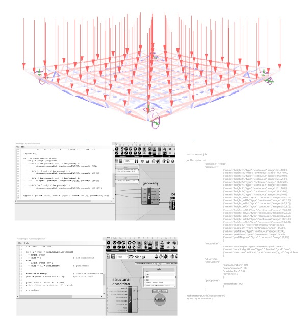
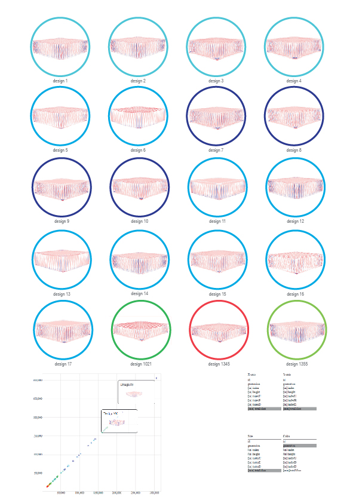
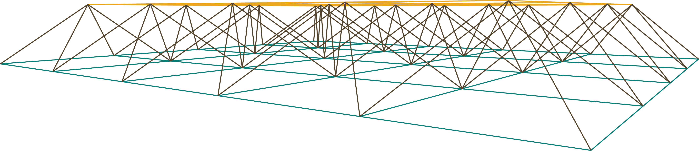

## Renato Godoi da Cruz
Arquiteto e Urbanista

##### contato
renatogcruz@hotmail.com

(19) 9 9716-5302

(19) 3541-4627

##### endereço
rua vitório mazon, 165

campestre

araras | sp

## INDICAÇÃO PESSOAL

Arquiteto e Urbanista graduado pela Escola de Minas - Universidade Federal de Ouro Preto (UFOP). Na graduação foi membro, durante o ano de 2014 e parte de 2015, do grupo de pesquisa (CNPq) HÍBRIDA - poéticas híbridas da cena contemporânea, grupo que integra pesquisadores das artes cênicas e outros cursos na investigação de conceitos, procedimentos e dispositivos de criação concernentes às poéticas híbridas da cena contemporânea, por meio de seu estudo, problematização e experimentação. Atualmente é aluno do Programa de Mestrado Profissional em Construção Metálica do Departamento de Eng. Civil da mesma instituição. Na ocasião pesquisa, explora e avalia o potencial da utilização dos algoritmos evolutivos como ferramenta de otimização integrada ao Design Generativo como método de projeto, identificando o conteúdo teórico de base, explorando e avaliando está abordagem em um estudo de caso.

## EDUCAÇÃO

##### Universidade Federal de Ouro Preto | UFOP

2016 - 2018	Mestrado (M.S.) em construção metálica

2010 - 2015 Bacharel (B.S.) em arquitetura e urbanismo

## CURSOS IMPORTANTES

2015 - interdisciplinar | ufmg - workshop de Urbanismo tático

2015 - ufop - oficina de arquitetura paramétrica

2013 - min. cidades - curso reabilitação urbana com foco em áreas centrais.

2017 - min. cidades - estudo de impacto de vizinhança - eiv

## EXPERIÊNCIAS PROFISSIONAIS

2016 - proj.arquitetura - cervejaria weiterbier | kamofa (mariana, mg)

2016 - eiv - estudo de impacto de vizinhança ouro preto tênis clube (ouro preto, mg)

##### Estágios

2014 (agosto à outubro) - bruno lopes studios (ribeirão preto, sp)

2014 (julho à agosto) - renata lemos paisagismo com. e serv. ltda (passos, mg)

2014 (julho à agosto) - virtual arquitetura e ambiente (passos, mg)

## HABILIDADES

## PUBLICAÇÕES

Nov, 2018 [Generative design in the design development of metallic constructions](http://www.proceedings.blucher.com.br/article-details/29707).
Published in the XXII International Congress of the Ibero-American Society of Digital Graphics.

Oct, 2016  [Interações contemporâneas: as mídias digitais como meio de produção, apropriação e planejamento das cidades](https://github.com/renatogcruz/CV/blob/master/others/paper_cats_2016.pdf). Published in the Architecture, Tourism and Sustainability Congress - CATS

##### Others
thesis, 2018 [Design generativo como ferramenta e metodologia projetual na construção metálica](http://www.repositorio.ufop.br/handle/123456789/10640)

tfg, 2015 [Mapas contemporâneos: os mapas colaborativos como meio de produção, apropriação e planejamento das cidades](https://github.com/renatogcruz/CV/blob/master/others/tfg_renatogcruz.pdf)

## Links

[LinkedIn](https://www.linkedin.com/in/renato-g-cruz-81632965/)

[Lattes](http://buscatextual.cnpq.br/buscatextual/visualizacv.do?id=K4388894U9)

---

---
## Oficina de ARQUITETURA PARAMÉTRICA

UNIVERSIDADE FEDERAL DE OURO PRETO | 2015

##### Design paramétrico | Arquitetura aberta | Arquitetura participativa

A oficina de Arquitetura Paramétrica foi oferecida no primeiro semestre de 2015 pelo Departamento de Arquitetura e Urbanismo em parceria com o professor e arquiteto Rafael Lemieszek Pinheiro. Durante o curso foi abordado aspectos da arquitetura aberta e da participativa nos processos de projeto. Projetos realizados: aplique de banco + protótipo de estúdio para práticas de obras do curso de arquitetura e urbanismo da universidade.

Protótipo do Estúdio para os alunos do curso de Arquitetura e Urbanismo da UFOP

----
Protótipo do Estúdio | Impressora 3D

----
Processo aplique rhinoceros + Grasshopper

----

----

[[+]](https://github.com/renatogcruz/workshop_parametric_architecture)

---
## Estudo DESIGN GENERATIVO MONOOBJETIVO DE TRELIÇA ESPACIAL

MINIMIZAÇÃO DE PESO x MAXIMIZAÇÃO DE SOMBRA

##### Design paramétrico | Galapagos | Design Generativo | Ladybug + Honeybee | Karamba 3D

Explorando o desenvolvimento projetual de uma cobertura, buscou-se revisar métodos baseados em algoritmos evolutivos (form finding) num
exercício de integração técnica de design paramétrico, algoritmos evolutivos e alguns requisitos de dimensionamento de treliças espaciais tubulares de aço. O objetivo foi discutir, criticamente, a relação do projetista com a perda de controle sobre o design final em troca do ganho de complexidade nos processos de concepção do espaço construído.

---
## Mestrado PROFISSIONAL EM CONSTRUÇÃO METÁLICA

UNIVERSIDADE FEDERAL DE OURO PRETO

##### Design paramétrico | Design generativo | Karamba 3D | Ladybug | Otimização multiobjetiva | GH Python

### Referência teórica

1. projeto como pergunta - Caio Adorno Vassão;

2. projeto e controle - Gaudí, Otto e Spuybroek;

3. projeto e natureza - Nagy, Yang, Shiffman;

4. projeto do projeto - Nagy

    
### Estratégia

1. construção do espaço de projeto;

2. desenvolvimento de medidas para avaliar o desempenho estrutural e ambiental;

3. a aplicação de algoritmos evolutivos para pesquisar o espaço do projeto e encontrar projetos de alto desempenho.

### Implementação, experimentos e aplicação do algoritmo generativo - o solucionador evolucionário *Discover*

### Análise

### Resultados

[[+]](https://github.com/renatogcruz/generative_design)

---
## Estudo DE INTERAÇÃO ENTRE GRASSHOPPER E PYTHON NO DESENVOLVIMENTO DE PROJETO DE ARQUITETURA E OTIMIZAÇÃO ESTRUTURAL

O CASO DE UMA TRELIÇA ESPACIAL PLANA

##### Design paramétrico | Design Generativo | GH Python | Karamba 3D

A maioria dos softwares de modelagem e computação gráfica oferecidos atualmente incorporam linguagens de *scripts* e uma vez que se
tem o domínio sobre esses recursos, podemos transcender quaisquer limitações que o software pode nos impor como *designer*. Dessa
forma, este estudo foca na potência dos algoritmos num exercício de arquitetura generativa.

---
## Estudos ALGORITMOS PARA OTIMIZAÇÃO GLOBAL INSPIRADOS NA EVOLUÇÃO BIOLÓGICA

Estudo dedicado a algoritmos evolutivos (EAs) e algoritmos genéticos (GA) com Python. Algoritmo genético é uma heurística de busca inspirada na teoria da evolução natural de Darwin. Este algoritmo reflete o processo de seleção natural, onde os indivíduos mais aptos são selecionados para reprodução, a fim de produzir descendentes para a próxima geração.

[[+]](https://github.com/renatogcruz/Evolutionary-computing)

---
## Arquitetura CONSTRUÍDA COM CÓDIGO

Computação como meio de design e impacto em disciplinas criativas e pedagogias relacionadas à educação em *design*.

##### Rhinoceros + Grasshopper | Python

1. Treliça simples

2. Treliça simples

3. Treliça espacial

[[+]](https://github.com/renatogcruz/DesignCode)

---
## Template PARA ANÁLISE ESTRUTURAL DE TRELIÇAS METÁLICAS]

Template para automatizar análise estrutural de treliças metálicas no ambiente Grasshopper + Karamba 3D

Algoritmo escrito em Python para automatizar projetos de treliças metálicas constituídas de barras tubulares, de acordo com a norma brasileira NBR8800.

[[+]](https://github.com/renatogcruz/truss_analysis)

---
## DATA-CAPTURE

Algoritmo para capturar dados produzidos durante o processo de otimização usando o Grasshopper + Galapagos (otimizador nativo GH)

Esse recurso funciona capturando viewports Rhino como arquivos de imagem PNG. Ele salva essas imagens em uma pasta com o mesmo nome do arquivo GH e no mesmo diretório onde está. Ele também captura os dados usados como 'genomas' e 'valor_fitness' durante o processo de otimização de Galápagos em um arquivo CSV, atribuindo seu nome e localização da mesma maneira descrita para as imagens.

Entradas:
1. Alternar: ativa o componente usando um booleano;
2. goalValue: recebe o valor da meta;
3. largura: largura da tela a ser capturada;
4. altura: altura da tela a ser capturada;
5. dados: lista de dados.

#### Entradas

#### Saídas

[[+]](https://github.com/renatogcruz/data-capture)
